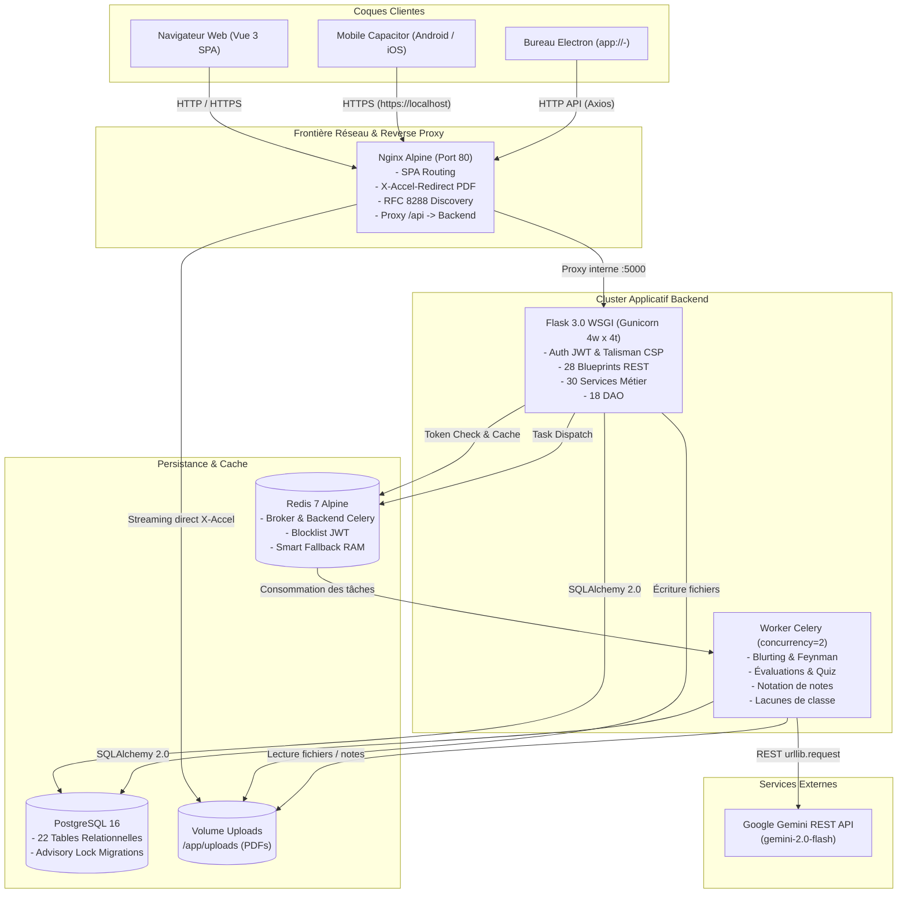

# Architecture Système — StudyHub

> Document de référence généré en mode cartographie (GSD).
> Description structurelle, cartographie des flux et inventaire technique complet sourcé (`fichier:ligne`).

---

## 1. Vue d'ensemble & Principes Directeurs

StudyHub est une plateforme d'apprentissage actif tout-en-un destinée aux étudiants de l'enseignement supérieur. Elle réunit la répétition espacée (algorithme SM-2), la prise de notes Markdown/LaTeX avec auto-test inline (« Révision Active »), la cartographie conceptuelle par diagrammes SVG, la lecture de PDF annotés, ainsi qu'un environnement pédagogique étendu (classes, devoirs, groupes de travail, examens blancs, évaluations formatives et tuteur IA sous Google Gemini).

### 1.1 Invariants d'Architecture
1. **Séparation stricte en couches** :
   ```
   Requête HTTP → Middleware (JWT, Limiter, Logs) → Route (Blueprint) → Service (Métier) → DAO → Modèle ORM → PostgreSQL
   ```
   - **DAO** : Seul point de contact avec SQLAlchemy et la base de données. N'importe jamais de service ([`AGENTS.md:111-112`](file:///C:/Users/denoe/Documents/Dev/StudyHub/AGENTS.md#L111-L112)).
   - **Service** : Porte la logique métier pure et dialogue exclusivement avec les DAO injectés et les schémas Pydantic. Ne fait aucune requête SQL directe ([`AGENTS.md:112-113`](file:///C:/Users/denoe/Documents/Dev/StudyHub/AGENTS.md#L112-L113)).
   - **Route** : Contrôleur léger. Valide les entrées (Pydantic), délègue au service, renvoie `jsonify` et les statuts HTTP conformes ([`AGENTS.md:113-115`](file:///C:/Users/denoe/Documents/Dev/StudyHub/AGENTS.md#L113-L115)).
2. **Isolation des données utilisateur (`user_id`)** :
   - Règle absolue : toute consultation filtre par `user_id` ; toute mutation vérifie l'appartenance de la ressource avant d'agir ([`AGENTS.md:129-145`](file:///C:/Users/denoe/Documents/Dev/StudyHub/AGENTS.md#L129-L145)).
3. **Format d'erreur unifié** :
   - Toutes les erreurs API renvoient l'enveloppe canonique `{ "error": { "code": "...", "message": "...", "details": {} } }` ([`AGENTS.md:148-153`](file:///C:/Users/denoe/Documents/Dev/StudyHub/AGENTS.md#L148-L153), [`backend/app/middlewares/error_handler.py:38-93`](file:///C:/Users/denoe/Documents/Dev/StudyHub/backend/app/middlewares/error_handler.py#L38-L93)).
4. **Codebase Frontend Unique** :
   - Un build web unique (`web/dist`) est encapsulé tel quel pour le Web, pour le Mobile (Capacitor 8) et pour le Bureau (Electron 33) sans réécriture ([`AGENTS.md:55-66`](file:///C:/Users/denoe/Documents/Dev/StudyHub/AGENTS.md#L55-L66)).

---

## 2. Topologie Globale du Système



---

## 3. Architecture Détaillée du Backend

### 3.1 Couche Interception & Middlewares (`backend/app/middlewares/`)
- **Authentification & Révocation** : `auth_middleware.py` ([`backend/app/middlewares/auth_middleware.py:1-60`](file:///C:/Users/denoe/Documents/Dev/StudyHub/backend/app/middlewares/auth_middleware.py#L1-L60)). Décorateur `@jwt_required_middleware`, vérification systématique de la présence du `jti` dans Redis via `@jwt.token_in_blocklist_loader`. Gestionnaires normalisés pour jetons absents, expirés, invalides ou révoqués.
- **Gestionnaire Global d'Erreurs** : `error_handler.py` ([`backend/app/middlewares/error_handler.py:1-93`](file:///C:/Users/denoe/Documents/Dev/StudyHub/backend/app/middlewares/error_handler.py#L1-L93)). Hiérarchie d'exceptions typées héritant de `AppError` (`ValidationError` 400, `UnauthorizedError` 401, `ForbiddenError` 403, `ResourceNotFoundError` 404, `ConflictError` 409). Traduction automatique des erreurs de validation Pydantic en chemin de champ (`loc`). Masquage des détails 500 en production.
- **Journalisation & Profilage SQL** : `request_logger.py` ([`backend/app/middlewares/request_logger.py:1-40`](file:///C:/Users/denoe/Documents/Dev/StudyHub/backend/app/middlewares/request_logger.py#L1-L40)). Mesure le temps de réponse de chaque requête et extrait le nombre de requêtes SQL exécutées (`current_request_query_count`). Émet un `WARNING` si la durée excède `SLOW_REQUEST_MS` (500 ms) ou si un volume suspect de requêtes SQL est détecté.
- **Sécurité Talisman & En-têtes** : Configuré dans `create_app` ([`backend/app/__init__.py:64-106`](file:///C:/Users/denoe/Documents/Dev/StudyHub/backend/app/__init__.py#L64-L106)). Applique HSTS (31536000s avec subdomains et preload), `SAMEORIGIN` pour les frames, et une Content Security Policy limitant les scripts et connexions autorisés.

### 3.2 Couche API & Routage (28 Blueprints, 26 fichiers dans `backend/app/api/v1/`)
Tous les blueprints sont préfixés par `/api/v1/` et déclarés dans `backend/app/__init__.py` ([`backend/app/__init__.py:125-180`](file:///C:/Users/denoe/Documents/Dev/StudyHub/backend/app/__init__.py#L125-L180)) :

| Blueprint | Préfixe URL | Fichier source | Domaine & Responsabilité |
|---|---|---|---|
| `auth_bp` | `/api/v1/auth` | `auth.py` | Inscription, connexion, refresh JWT, déconnexion, suppression compte |
| `users_bp` | `/api/v1/users` | `users.py` | Profil utilisateur connecté (`/me`) |
| `binders_bp` | `/api/v1/binders` | `binders.py` | CRUD classeurs, rattachement/détachement items, tags, visibilité |
| `decks_bp` | `/api/v1/decks` | `decks.py` | CRUD paquets de flashcards, sessions d'étude du deck, tags |
| `flashcards_bp` | `/api/v1/decks/<deck_id>/cards` | `flashcards.py` | CRUD cartes mémoire rattachées à un deck, historique |
| `flashcards_global_bp` | `/api/v1/flashcards` | `flashcards.py` | Génération de cartes par IA, révision SM-2 globale |
| `revision_bp` | `/api/v1/revision` | `revision.py` | Ensembles de révision hétérogènes, items, sessions d'évaluation |
| `notes_bp` | `/api/v1/notes` | `notes.py` | CRUD fiches de cours, masquage, partage public par token, tags |
| `diagrams_bp` | `/api/v1/diagrams` | `diagrams.py` | CRUD diagrammes (payload SVG / JSON), tags |
| `pdfs_bp` | `/api/v1/pdfs` | `pdfs.py` | Upload, métadonnées, suppression et streaming sécurisé de PDF |
| `stats_bp` | `/api/v1/stats` | `stats.py` | Vue d'ensemble, heatmap d'activité, stats par deck/binder/set |
| `health_bp` | `/api/v1/health` | `health.py` | Endpoint de liveness / readiness pour orchestration |
| `blurting_bp` | `/api/v1/blurting` | `blurting.py` | Analyse IA de restitution de cours (page blanche), suivi tâche |
| `feynman_bp` | `/api/v1/feynman` | `feynman.py` | Analyse IA d'explication vulgarisée (technique Feynman) |
| `notation_bp` | `/api/v1/notation` | `notation.py` | Évaluation IA globale de qualité de note et conseils de révision |
| `packages_bp` | `/api/v1/packages` | `packages.py` | Marketplace communautaire, consultation et clonage de classeurs |
| `tags_bp` | `/api/v1/tags` | `tags.py` | CRUD des étiquettes transversales de l'utilisateur |
| `focus_bp` | `/api/v1/focus` | `focus.py` | Prévisions de charge de révision quotidienne et taux de rétention |
| `planning_bp` | `/api/v1/planning` | `planning.py` | Calendrier des révisions dues et avancement simulé dans le temps |
| `search_bp` | `/api/v1/search` | `search.py` | Recherche plein texte multi-entités unifiée (notes, decks, etc.) |
| `imports_bp` | `/api/v1/import` | `imports.py` | Importation de paquets au format Anki (.apkg) |
| `quizzes_bp` | `/api/v1/quizzes` | `quizzes.py` | Génération de QCM IA sur note, soumission réponses, bilan |
| `evaluations_bp` | `/api/v1/evaluations` | `evaluations.py` | Évaluations formatives structurées par notion, validation |
| `exam_bp` | `/api/v1/exam` | `exam.py` | Sessions d'examen en temps limité, correction et notation |
| `groups_bp` | `/api/v1/groups` | `groups.py` | Groupes d'étude collaboratifs, membres, partage de classeurs |
| `classes_bp` | `/api/v1/classes` | `classes.py` | Espace enseignant/classe, devoirs, flux d'activité, questions Q&A |
| `assignments_mine_bp` | `/api/v1/assignments` | `classes.py` | Devoirs assignés à l'étudiant connecté (`/mine`) |
| `notifications_bp` | `/api/v1/notifications` | `notifications.py` | Notifications in-app, compteur non lues, acquittement |

### 3.3 Couche Logique Métier (30 Services dans `backend/app/services/`)
- **Gestion des Contenus & Organisation** : `note_service.py`, `deck_service.py`, `binder_service.py`, `binder_items_service.py`, `diagram_service.py`, `pdf_service.py`, `tag_service.py`.
- **Moteur Pédagogique & Spaced Repetition** :
  - `spaced_repetition.py` : Implémentation mathématique SM-2 pure avec fine-tuning ([`backend/app/services/spaced_repetition.py:4-50`](file:///C:/Users/denoe/Documents/Dev/StudyHub/backend/app/services/spaced_repetition.py#L4-L50)).
  - `flashcard_service.py` et `revision_service.py` : Pilotent la progression des cartes, calculent les prochaines échéances et appliquent les notes.
  - `quiz_service.py` et `exam_service.py` : Gestion des sessions d'évaluation interactives et des examens chronométrés.
- **Intégration IA & Cognition** :
  - `ai_service.py` : 883 lignes de prompts et d'appels directs Gemini REST pour l'analyse sémantique, la notation et la génération de contenu pédagogique ([`backend/app/services/ai_service.py:1-883`](file:///C:/Users/denoe/Documents/Dev/StudyHub/backend/app/services/ai_service.py#L1-L883)).
  - `flashcard_generation_service.py` et `evaluation_service.py` : Génération de matériel pédagogique basé sur la couverture conceptuelle des notes.
- **Analytique & Planning** : `stats_service.py`, `revision_stats_service.py`, `focus_service.py`, `planning_service.py`, `analytics_service.py`, `engagement_service.py`.
- **Collaboration, Communauté & Classes** : `class_service.py`, `class_management_service.py`, `class_qa_service.py`, `group_service.py`, `community_service.py`, `import_service.py`.
- **Utilisateurs & Identité** : `auth_service.py`, `user_service.py`.

### 3.4 Couche d'Accès aux Données (18 DAO dans `backend/app/dao/`)
- **Générique** : `base_dao.py` (`BaseDAO[T]`, fournit `get_by_id`, `get_all` avec filtre `user_id`, `create`, `update`, `delete`, [`backend/app/dao/base_dao.py:6-37`](file:///C:/Users/denoe/Documents/Dev/StudyHub/backend/app/dao/base_dao.py#L6-L37)).
- **DAO Spécialisés** :
  `assignment_dao`, `binder_dao`, `deck_dao`, `diagram_dao`, `evaluation_dao`, `exam_dao`, `flashcard_dao`, `group_dao`, `note_dao`, `note_grade_dao`, `pdf_dao`, `quiz_dao`, `revision_dao`, `search_dao`, `study_session_dao`, `tag_dao`, `user_dao`.
- **Eager Loading Systématique** : Utilisation de `joinedload` et `selectinload` pour prévenir les requêtes N+1 sur les graphes d'objets (notes, tags, flashcards, classeurs).

### 3.5 Modèles de Données SQLAlchemy (22 Modèles dans `backend/app/models/`)
- `User` (`user.py`) : Compte, mot de passe hashé, rôle enseignant/étudiant, timestamps.
- `Binder` (`binder.py`) : Classeur hiérarchique (arborescence parent/enfant), visibilité publique/privée, description.
- `HiddenBinder` (`hidden_binder.py`) & `HiddenNote` (`hidden_note.py`) : Préférences de masquage utilisateur.
- `Deck` (`deck.py`) : Paquet de flashcards, options de révision, association classeur.
- `Flashcard` (`flashcard.py`) : Carte recto/verso, variables SM-2 (`ease_factor`, `interval`, `repetitions`, `next_review`), type de carte (classique, cloze, QCM).
- `Note` (`note.py`) : Titre, contenu Markdown/LaTeX, token de partage public, horodatage du dernier blurting.
- `NoteGrade` (`note_grade.py`) : Évaluation IA persistée (score, verdict, points forts, améliorations, suggestions).
- `Diagram` (`diagram.py`) : Métadonnées et payload géométrique SVG/JSON.
- `PdfDocument` (`pdf_document.py`) : Fichier stocké, nom original, taille, statut d'indexation.
- `Tag` (`tag.py`) : Étiquettes couleur et tables d'association `binder_tags`, `deck_tags`, `note_tags`, `diagram_tags`, `pdf_tags`.
- `StudySession` (`study_session.py`) : Historique des sessions de révision pour le calcul des statistiques et de la heatmap.
- `RevisionSet` & `RevisionItem` (`revision.py`) : Ensembles d'entraînement transversaux.
- `Quiz` & `QuizQuestion` (`quiz.py`) : Évaluations courtes auto-générées.
- `Evaluation` & `EvaluationItem` (`evaluation.py`) : Évaluations formatives structurées.
- `ExamSession` (`exam.py`) : Sessions d'examen surveillées avec temps limite.
- `Group` & `GroupMember` (`group.py`) : Groupes d'étude collaboratifs.
- `Assignment` & `AssignmentTask` (`assignment.py`) : Devoirs distribués par les enseignants avec suivi de rendu.
- `ClassInsight` (`class_insight.py`) : Analyses agrégées des points de friction des élèves.
- `ClassQuestion` (`class_question.py`) : Forum d'entraide questions/réponses lié à une classe.
- `Notification` (`notification.py`) : Alertes in-app pour les devoirs, les révisions et la classe.
- `SearchType` (`search_type.py`) : Énumérations pour la recherche globale.

### 3.6 Schémas Pydantic (22 Schémas dans `backend/app/schemas/`)
Séparation stricte des DTO d'entrée (Requête : `*Create`, `*Update`) et de sortie (Réponse : `*Response`, `*DetailResponse`) avec `from_attributes = True` pour la sérialisation directe depuis les entités SQLAlchemy.

---

## 4. Traitement Asynchrone & Pipeline IA

### 4.1 Dispatcher et Tolérance aux Pannes
Les inférences IA longues (analyse de texte sémantique par Gemini) sont déportées dans Celery pour ne pas bloquer les threads WSGI. 

L'utilitaire `dispatch_or_run` ([`backend/app/utils/task_dispatch.py:6-33`](file:///C:/Users/denoe/Documents/Dev/StudyHub/backend/app/utils/task_dispatch.py#L6-L33)) assure une dégradation gracieuse :
- **En production (Redis opérationnel)** : `task.delay(...)` → renvoie `("async", AsyncResult)`, l'API répond un code HTTP `202 Accepted` avec `task_id`. Le client sonde ensuite l'endpoint `/tasks/<task_id>`.
- **En développement / Hors-ligne (Redis absent)** : L'exception de connexion est interceptée, la tâche s'exécute immédiatement en synchrone inline dans le contexte applicatif, et l'API répond un code HTTP `200 OK`.

### 4.2 Tâches Celery Référencées (`backend/app/tasks.py`)
1. **`run_blurting_analysis`** ([`backend/app/tasks.py:16`](file:///C:/Users/denoe/Documents/Dev/StudyHub/backend/app/tasks.py#L16)) : Compare la restitution de mémoire de l'étudiant avec le cours modèle, produit un score de rétention, une liste de concepts maîtrisés/manqués et suggère des flashcards correctives.
2. **`run_feynman_analysis`** ([`backend/app/tasks.py:75`](file:///C:/Users/denoe/Documents/Dev/StudyHub/backend/app/tasks.py#L75)) : Évalue l'aptitude de l'élève à expliquer simplement un concept sans jargon.
3. **`run_note_grading`** ([`backend/app/tasks.py:118`](file:///C:/Users/denoe/Documents/Dev/StudyHub/backend/app/tasks.py#L118)) : Analyse la structure pédagogique d'une note de cours et persiste la note dans `note_grades`.
4. **`run_class_gap_analysis`** ([`backend/app/tasks.py:155`](file:///C:/Users/denoe/Documents/Dev/StudyHub/backend/app/tasks.py#L155)) : Agrége les notions échouées par les élèves d'une classe et génère une synthèse IA pour l'enseignant.
5. **`run_evaluation_generation`** ([`backend/app/tasks.py:188`](file:///C:/Users/denoe/Documents/Dev/StudyHub/backend/app/tasks.py#L188)) : Génère une batterie d'exercices d'évaluation formative adaptée à la note.

---

## 5. Algorithme de Répétition Espacée (SM-2)

Le cœur algorithmique de révision repose sur SuperMemo-2, enrichi d'un multiplicateur de réglage fin (`tuning`, D4) ([`backend/app/services/spaced_repetition.py:4-50`](file:///C:/Users/denoe/Documents/Dev/StudyHub/backend/app/services/spaced_repetition.py#L4-L50)) :

```python
def calculate_sm2(
    score: int,              # Note attribuée de 0 à 5
    ease_factor: float,      # Facteur de facilité courant (initial: 2.5)
    interval: int,           # Intervalle courant en jours
    repetitions: int,        # Nombre de révisions réussies consécutives
    tuning: float = 1.0      # Modulateur de rythme (D4)
) -> Tuple[float, int, int, datetime]
```

### Invariants Mathématiques SM-2
1. **Mise à jour de l'Ease Factor (EF)** :
   $$EF' = \max\left(1.3, \; EF + (0.1 - (5 - q) \times (0.08 + (5 - q) \times 0.02))\right)$$
   Le facteur ne descend jamais en dessous du plancher strict de **1.3**.
2. **Calcul de l'intervalle** :
   - Si $q < 3$ (échec) : répétitions remises à 0, nouvel intervalle = 1 jour.
   - Si $q \ge 3$ (succès) :
     - 1ère réussite ($n=0$) : $I_1 = 1$ jour
     - 2ème réussite ($n=1$) : $I_2 = 6$ jours
     - $n \ge 2$ : $I_n = \text{round}(I_{n-1} \times EF')$
3. **Ajustement Fin (Fine-Tuning)** :
   - L'intervalle calculé est multiplié par `tuning` (plancher garanti à 1 jour). L'EF n'est pas impacté par le tuning.

---

## 6. Architecture du Frontend Web

### 6.1 Organisation des Vues & Navigation Canonique
L'application s'articule autour de **5 sections canoniques majeures** issues du plan de refonte UI ([`web/src/router/index.ts:48-88`](file:///C:/Users/denoe/Documents/Dev/StudyHub/web/src/router/index.ts#L48-L88)) :
1. **Accueil (`/accueil`)** : Fusion du Dashboard et du Focus mode. Vue d'action immédiate (actions du jour, cartes dues, Pomodoro).
2. **Bibliothèque (`/bibliotheque/:id?`)** : Arborescence complète des classeurs, notes, paquets et documents PDF.
3. **Réviser (`/reviser`)** : Hub de révision unifié pour lancer des sessions par deck, classeur ou ensemble d'items.
4. **Classes (`/classes`)** : Espace partagé avec onglets Enseignant (devoirs, suivi) et Étudiant (travaux à rendre).
5. **Decks (`/decks`)** : Gestionnaire et sessions d'étude dédiées aux flashcards.

### 6.2 Routage & Historique Multi-Environnement
Pour satisfaire les contraintes du bureau Electron (servi sous `app://-`), le routeur adapte dynamiquement son mode d'historique ([`web/src/router/index.ts:262-265`](file:///C:/Users/denoe/Documents/Dev/StudyHub/web/src/router/index.ts#L262-L265)) :
- **Web & Mobile (Capacitor)** : `createWebHistory()` (HTML5 History API propre).
- **Desktop (Electron)** : `createWebHashHistory()` (ancres `#` évitant les erreurs de résolution de fichiers locaux).

### 6.3 Gestion de l'État Global (Pinia — 12 Stores dans `web/src/stores/`)
| Store | Responsabilité |
|---|---|
| `auth.ts` | Jeton JWT, utilisateur courant, persistance localStorage, refresh automatique |
| `binders.ts` | Arbre des classeurs, navigation dans les dossiers, création et visibilité |
| `decks.ts` | Paquets de cartes mémoires, tirage des cartes dues, notation SM-2 |
| `notes.ts` | Fiches de cours, mode édition, sauvegarde automatique, partages |
| `revision.ts` | Moteur des sessions d'entraînement transversales et ensembles d'items |
| `pomodoro.ts` | Minuteur d'étude, cycles travail/pause, notification de fin de cycle |
| `focus.ts` | Statistiques de rétention et prévisions de charge d'étude |
| `groups.ts` | Groupes d'étude collaboratifs et progression des membres |
| `pdf.ts` | Gestionnaire de documents PDF et annotations |
| `planning.ts` | Échéancier de révision calendaire et projections |
| `tags.ts` | Étiquettes transversales filtrables |
| `notifications.ts` | Flux des notifications utilisateur |

### 6.4 Services API Frontend (`web/src/services/`)
- `api.ts` : Instance Axios unique configurée avec base URL adaptative, intercepteur d'injection Bearer JWT, intercepteur de réponse 401 pour renouvellement de jeton transparent sans perte de requête en vol, et timeout étendu à 120s pour absorber les inférences IA ([`web/src/services/api.ts:5-61`](file:///C:/Users/denoe/Documents/Dev/StudyHub/web/src/services/api.ts#L5-L61)).
- Services de domaine : `classService.ts`, `evaluationService.ts`, `examService.ts`, `feynmanService.ts`, `focusService.ts`, `groupService.ts`, `notationService.ts`, `notificationService.ts`, `planningService.ts`, `quizService.ts`, `searchService.ts`, `assignmentTasks.ts`.

---

## 7. Architecture Multi-Plateforme (Mobile & Bureau)

### 7.1 Stratégie d'Encapsulation Unique
Le projet ne maintient aucune base de code dupliquée pour le natif :
```
web/src/ (Vue 3)  ──[vite build]──>  web/dist/
                                         │
        ┌────────────────────────────────┼────────────────────────────────┐
        ▼                                ▼                                ▼
  Nginx (Web)                 Capacitor 8 (Mobile)              Electron 33 (Desktop)
Serveur HTTP/SPA             webDir: 'dist' encapsulé           electron-serve ('dist')
Port 80                      web/android/ (Gradle)              desktop/src/main.ts
```

### 7.2 Intégration Mobile (Capacitor 8)
- Projet Android généré dans `web/android/`.
- `androidScheme: 'https'` ([`web/capacitor.config.ts:10`](file:///C:/Users/denoe/Documents/Dev/StudyHub/web/capacitor.config.ts#L10)) garantit que l'origine Web interne est `https://localhost`, autorisant l'utilisation native des cookies, de l'historique HTML5 et des règles CORS standard de l'API.

### 7.3 Intégration Bureau (Electron 33)
- Processus principal : `desktop/src/main.ts` ([`desktop/src/main.ts:1-68`](file:///C:/Users/denoe/Documents/Dev/StudyHub/desktop/src/main.ts#L1-L68)).
- Sécurité renforcée : Sandbox active, isolation de contexte, désactivation complète de `nodeIntegration`.
- Protocole personnalisé `app://-` via `electron-serve` en production ; proxy vers `http://localhost:5173` avec HMR en développement.
- Preload sécurisé : `desktop/src/preload.ts` n'expose au renderer que `{ isDesktop: true, version }` ([`desktop/src/preload.ts:9-12`](file:///C:/Users/denoe/Documents/Dev/StudyHub/desktop/src/preload.ts#L9-L12)).

---

## 8. Capacités d'Agent IA & Découverte Web

Le système intègre des dispositions spécifiques pour l'exploration par des agents IA autonomes :
1. **Négociation de Contenu (Markdown First)** :
   Nginx intercepte les requêtes présentant l'en-tête `Accept: text/markdown` pour rediriger directement les agents vers les versions Markdown brutes des fiches sans charger l'interface graphique Vue.js ([`web/nginx.spa.conf:14-19`](file:///C:/Users/denoe/Documents/Dev/StudyHub/web/nginx.spa.conf#L14-L19)).
2. **Découverte RFC 8288** :
   En-têtes HTTP `Link` renvoyant vers le catalogue d'API et la fiche d'agent :
   `Link: </.well-known/api-catalog>; rel="api-catalog", </docs/api>; rel="service-doc", </.well-known/agent-card.json>; rel="agent-card"` ([`web/nginx.spa.conf:21-22`](file:///C:/Users/denoe/Documents/Dev/StudyHub/web/nginx.spa.conf#L21-L22)).
3. **WebMCP Runtime** :
   Enregistrement dynamique d'outils au niveau du navigateur via `navigator.modelContext.registerTool` pour permettre aux assistants IA d'exécuter des recherches structurées dans la marketplace ([`web/src/main.ts:28-48`](file:///C:/Users/denoe/Documents/Dev/StudyHub/web/src/main.ts#L28-L48)).

---

## 9. Base de Données & Stratégie de Migration

- **Gestionnaire** : Alembic via `Flask-Migrate`.
- **Répertoire de versions** : `backend/migrations/versions/` (27 fichiers de migration jusqu'à la révision de tête `1a36d88922ba`, [`backend/migrations/versions/1a36d88922ba_add_note_grades_table.py:1-54`](file:///C:/Users/denoe/Documents/Dev/StudyHub/backend/migrations/versions/1a36d88922ba_add_note_grades_table.py#L1-L54)).
- **Auto-application au démarrage** : Gérée exclusivement dans `backend/wsgi.py` via `run_auto_migrations` ([`backend/wsgi.py:15`](file:///C:/Users/denoe/Documents/Dev/StudyHub/backend/wsgi.py#L15), [`backend/app/db_migrate.py:25-39`](file:///C:/Users/denoe/Documents/Dev/StudyHub/backend/app/db_migrate.py#L25-L39)).
- **Concurrence & Advisory Lock** : En environnement multi-workers (Gunicorn), la migration est protégée par un verrou d'avis PostgreSQL stable (`SELECT pg_advisory_lock(7270727)`), garantissant qu'un seul worker n'applique les migrations à la fois ([`backend/app/db_migrate.py:22,43-47`](file:///C:/Users/denoe/Documents/Dev/StudyHub/backend/app/db_migrate.py#L22-L47)).
- **Garde Anti-Drift en CI** : Le job CI applique les migrations puis tente un `flask db migrate`. Si un fichier de migration est généré automatiquement, le pipeline échoue, forçant les développeurs à versionner explicitement toute modification de modèle ([`.github/workflows/ci.yml:128-146`](file:///C:/Users/denoe/Documents/Dev/StudyHub/.github/workflows/ci.yml#L128-L146)).

---

## 10. Dette Architecturale & Écarts Documentés

Constats issus des audits formels (`docs/audit/02-ARCHITECTURE.md` et `ETAT.md`) :

1. **ARCH-01 : Court-circuits du patron DAO** ([`docs/audit/02-ARCHITECTURE.md:17-41`](file:///C:/Users/denoe/Documents/Dev/StudyHub/docs/audit/02-ARCHITECTURE.md#L17-L41))
   - *Constat* : 13 fichiers de services exécutent des requêtes ORM directes (`.query(`) et 23 fichiers de routes référencent `db.session` au lieu de déléguer strictement à la couche DAO.
   - *Traitement* : Remise en conformité incrémentale actée pour les chantiers futurs (phase 6 backlog).
2. **ARCH-02 : Résolution directe dans les routes publiques** ([`docs/audit/02-ARCHITECTURE.md:43-66`](file:///C:/Users/denoe/Documents/Dev/StudyHub/docs/audit/02-ARCHITECTURE.md#L43-L66))
   - *Constat* : Les routes de partage public (`binders.py:151`, `notes.py:128`, `packages.py:36`, `classes.py:193`) importent les modèles et exécutent des requêtes en ligne sans passer par un service ou DAO.
3. **ARCH-03 & ARCH-04 : Traversée récursive et risque N+1 dans `packages.py`** ([`docs/audit/02-ARCHITECTURE.md:68-105`](file:///C:/Users/denoe/Documents/Dev/StudyHub/docs/audit/02-ARCHITECTURE.md#L68-L105))
   - *Constat* : Logique d'agrégation d'arborescence de classeur codée directement dans le contrôleur avec traversée déclenchant du lazy-loading en cascade.
4. **Liaison Note-Flashcard non persistée** ([`ETAT.md:1140-1152`](file:///C:/Users/denoe/Documents/Dev/StudyHub/ETAT.md#L1140-L1152))
   - *Constat* : Dans `NoteEdit.vue`, la liaison entre un texte masqué `{{trou::}}` et une flashcard pour notation SM-2 différée attend une clé `flashcards` dans `NoteResponse` qui n'est pas fournie par le backend.
5. **Divergence de schéma SQLite vs PostgreSQL dans les tests** ([`docs/ENVIRONNEMENT.md:61-72`](file:///C:/Users/denoe/Documents/Dev/StudyHub/docs/ENVIRONNEMENT.md#L61-L72))
   - *Constat* : La suite de tests exécutée sur PostgreSQL échoue sur des index spécifiques (index GIN plein texte) créés par migration brute et non par `db.create_all()`.

---

## 11. Inconnues & Périmètres Non Déterminés

Conformément au contrat de recherche, les éléments suivants n'ont pas pu être déterminés à partir des artefacts présents dans le dépôt :
1. **Configuration et provisionnement natif iOS** : Bien que Capacitor supporte iOS et que des références de compatibilité iOS 16+ existent dans la documentation, aucun répertoire natif Xcode / CocoaPods (`web/ios/` ou `ios/`) n'est présent dans le dépôt (seul `web/android/` est versionné). La génération du projet iOS requiert manifestement un environnement macOS non disponible ici.
2. **Infrastructure de production & Clés réelles** : Les configurations DNS, certificats TLS et clés d'accès réelles (Gemini API, secret JWT de production) sont gérées hors dépôt (variables d'environnement injectées au déploiement).
3. **Politique de mise à l'échelle des workers Celery** : Le fichier `docker-compose.yml` fige le worker à `--concurrency=2`. Aucun fichier de configuration de mise à l'échelle automatique (Autoscaling, Kubernetes HPA ou queues multiples prioritaires) n'a été identifié.
