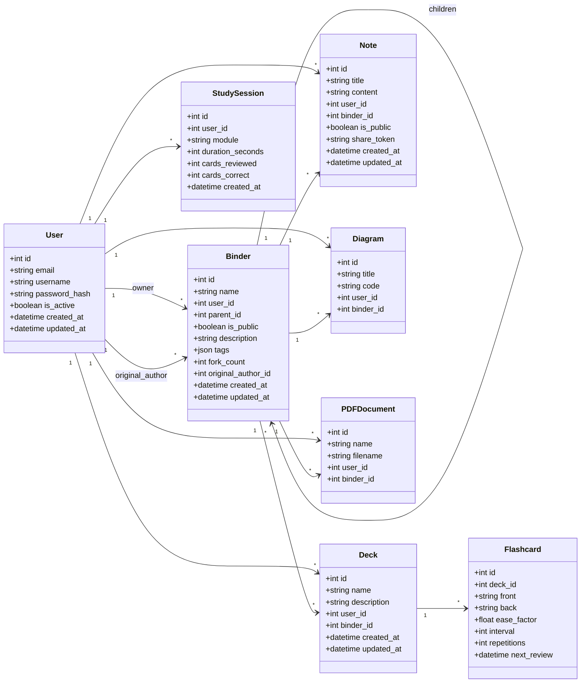

# Documentation Technique du Backend Flask — StudyHub

Cette documentation détaille l'architecture, le modèle de données, les services et les choix d'implémentation de la partie backend de StudyHub.

## 1. Architecture en couches

Le backend respecte une architecture en couches stricte (conforme aux principes SOLID) :

```
             HTTP Request
                  │
                  ▼
            [Middlewares]  ◄─── auth_middleware, error_handler, request_logger
                  │
                  ▼
             [API Layer]   ◄─── Blueprints Flask (validation des entrées via Pydantic)
                  │
                  ▼
              [Service]    ◄─── Logique métier & orchestration des cas d'usage
                  │
                  ▼
                [DAO]      ◄─── Requêtes SQL (SQLAlchemy) isolées de la logique métier
                  │
                  ▼
               [Model]     ◄─── Entités de données (Modèles SQLAlchemy)
                  │
                  ▼
             PostgreSQL / SQLite
```

### Rôles des composants
* **Models (`app/models/`)** : Définissent la structure de la base de données.
* **DAO (`app/dao/`)** : Héritent de `BaseDAO`. C'est le seul endroit où sont écrites les requêtes SQLAlchemy.
* **Services (`app/services/`)** : Portent toute la logique applicative (ex: calculs SM-2, vérification des contraintes). Ils manipulent des schémas Pydantic.
* **API (`app/api/v1/`)** : Reçoivent les requêtes HTTP, valident le corps des requêtes avec Pydantic, délèguent immédiatement au service approprié, et retournent la réponse avec le code HTTP adapté.
* **Middlewares (`app/middlewares/`)** : Gestionnaires transversaux pour l'authentification JWT, le logging et la gestion globale des exceptions avec un format d'erreur standardisé.

---

## 2. Modèle de données (Entity Layer)



---

## 3. Algorithme de répétition espacée SM-2

L'algorithme de répétition espacée SuperMemo-2 (SM-2) est implémenté dans [spaced_repetition.py](file:///home/robyn/Documents/Dev/StudyHub/backend/app/services/spaced_repetition.py) :

1. **Calcul du Facteur de Facilité ($EF$)** :
   $$EF' = \max\left(1.3, EF + (0.1 - (5 - q) \times (0.08 + (5 - q) \times 0.02))\right)$$
   où $q$ est le score d'évaluation de 0 à 5 fourni par l'étudiant.
2. **Calcul de l'intervalle ($I$, en jours)** :
   * Si l'évaluation échoue ($q < 3$) : la répétition retombe à 0, l'intervalle est fixé à $1$ jour, et le facteur $EF$ est ajusté à la baisse.
   * Si la révision réussit ($q \ge 3$) :
     * 1ère répétition : $I = 1$ jour
     * 2ème répétition : $I = 6$ jours
     * répétitions suivantes : $I = \text{round}(I \times EF)$
3. **Mise à jour** : La date de prochaine révision est programmée pour $\text{maintenant} + I \text{ jours}$.

---

## 4. Endpoints API v1

Tous les endpoints sont préfixés par `/api/v1` et sont sécurisés par JWT (sauf `auth/register`, `auth/login` et `health`).

| Module | Méthode | Route | Description |
|---|---|---|---|
| **Santé** | `GET` | `/health` | Statut de l'API |
| **Auth** | `POST` | `/auth/register` | Inscription d'un utilisateur |
| | `POST` | `/auth/login` | Connexion (renvoie l'access & refresh token) |
| | `POST` | `/auth/refresh` | Rafraîchissement de l'access token |
| | `POST` | `/auth/logout` | Déconnexion de l'utilisateur |
| | `DELETE` | `/auth/account` | Suppression RGPD immédiate du compte |
| **Profil** | `GET` | `/users/me` | Profil de l'utilisateur connecté |
| | `PUT` | `/users/me` | Mise à jour du profil |
| **Classeurs** | `GET` | `/binders` | Liste paginée des classeurs (`?parent_id=`) |
| | `POST` | `/binders` | Création d'un classeur |
| | `GET` | `/binders/<id>` | Détails d'un classeur |
| | `PUT` | `/binders/<id>` | Modification d'un classeur |
| | `DELETE` | `/binders/<id>` | Suppression récursive d'un classeur |
| | `PATCH` | `/binders/<id>/visibility` | Toggle visibilité publique |
| | `GET` | `/binders/public/<id>` | Détails publics d'un classeur |
| **Decks** | `GET` | `/decks` | Recherche et liste paginée des decks |
| | `POST` | `/decks` | Création d'un deck |
| | `GET` | `/decks/<id>` | Détails d'un deck |
| | `PUT` | `/decks/<id>` | Modification d'un deck |
| | `DELETE` | `/decks/<id>` | Suppression d'un deck |
| | `GET` | `/decks/<id>/study` | Récupère les cartes à réviser aujourd'hui |
| | `POST` | `/decks/<id>/study/answer/<card_id>` | Soumet le score de révision d'une carte (SM-2) |
| **Cartes** | `GET` | `/decks/<deck_id>/cards` | Liste paginée des cartes d'un deck |
| | `POST` | `/decks/<deck_id>/cards` | Ajout d'une carte à un deck |
| | `GET` | `/decks/<deck_id>/cards/<id>` | Détails d'une carte |
| | `PUT` | `/decks/<deck_id>/cards/<id>` | Modification d'une carte |
| | `DELETE` | `/decks/<deck_id>/cards/<id>` | Suppression d'une carte |
| **Notes** | `GET` | `/notes` | Recherche et liste paginée des notes |
| | `POST` | `/notes` | Création d'une note |
| | `GET` | `/notes/<id>` | Détails d'une note |
| | `PUT` | `/notes/<id>` | Modification d'une note |
| | `DELETE` | `/notes/<id>` | Suppression d'une note |
| | `PATCH` | `/notes/<id>/visibility` | Toggle visibilité publique |
| | `GET` | `/notes/public/<token>` | Consulter une note publique via son token |
| **Packages (Marketplace)** | `GET` | `/packages` | Liste paginée des packages publics |
| | `GET` | `/packages/<binder_id>` | Détails d'un package public |
| | `POST` | `/packages/<binder_id>/clone` | Cloner un package public |
| **Blurting (Feuille Blanche IA)** | `POST` | `/blurting/analyze` | Analyser la restitution écrite par l'IA |
| | `POST` | `/blurting/create-flashcards` | Créer les flashcards suggérées |
| **Évaluations (Feuille IA)** | `POST` | `/evaluations/generate` | Générer une feuille d'évaluation mixte (async, IA) |
| | `GET` | `/evaluations/tasks/<task_id>` | Sonder la tâche de génération |
| | `GET` | `/evaluations/<id>` | Récupérer une évaluation |
| | `POST` | `/evaluations/<id>/items/<item_id>/answer` | Répondre à un item (correction par type) |
| | `POST` | `/evaluations/<id>/complete` | Compléter, scorer et alimenter le SM-2 |
| **Diagrammes** | `GET` | `/diagrams` | Liste paginée des diagrammes |
| | `POST` | `/diagrams` | Création d'un diagramme Mermaid |
| | `GET` | `/diagrams/<id>` | Détails d'un diagramme |
| | `PUT` | `/diagrams/<id>` | Modification d'un diagramme |
| | `DELETE` | `/diagrams/<id>` | Suppression d'un diagramme |
| **PDFs** | `GET` | `/pdfs` | Liste paginée des documents PDF |
| | `POST` | `/pdfs` | Téléchargement PDF (multipart/form-data) |
| | `GET` | `/pdfs/<id>` | Métadonnées d'un document PDF |
| | `GET` | `/pdfs/<id>/file` | Stream du fichier PDF physique |
| | `DELETE` | `/pdfs/<id>` | Suppression physique et logique d'un PDF |
| **Stats** | `GET` | `/stats/overview` | Statistiques globales (streak, temps total, scores) |
| | `GET` | `/stats/sessions` | Historique des sessions d'étude |
| | `POST` | `/stats/sessions` | Enregistrement d'une nouvelle session d'étude |
| | `GET` | `/stats/heatmap` | Données de calendrier d'activité (365 jours) |
| | `GET` | `/stats/decks/<deck_id>` | Stats de rétention par deck |

---

## 5. Gestion et exécution des migrations automatiques

Le projet utilise **Alembic** (via **Flask-Migrate**) pour gérer les schémas de base de données.
Pour simplifier le déploiement et la mise en production, l'application Flask intègre un mécanisme d'auto-détection et d'auto-migration automatique au lancement.

### Fonctionnement au démarrage (`app/__init__.py`)
1. Lorsque l'application Flask s'initialise (via `create_app()`), elle vérifie si elle est exécutée dans un contexte de serveur HTTP (pour ne pas interférer avec les commandes CLI ou les tests unitaires).
2. Elle examine la base de données. Si la base de données n'existe pas encore (notamment en mode SQLite), elle est automatiquement créée.
3. Elle exécute ensuite de manière programmatique la commande `flask db upgrade` d'Alembic en utilisant le contexte d'application.
4. Cela permet de déployer une nouvelle version de l'application sur le serveur sans avoir à exécuter manuellement les scripts de migration en ligne de commande.

---

## 6. Exécution des tests unitaires

Les tests unitaires utilisent une base de données SQLite en mémoire pour garantir l'isolation et la vitesse d'exécution.

```bash
# Activation de l'environnement virtuel
source backend/venv/bin/activate

# Lancement des tests pytest
cd backend
python -m pytest
```
